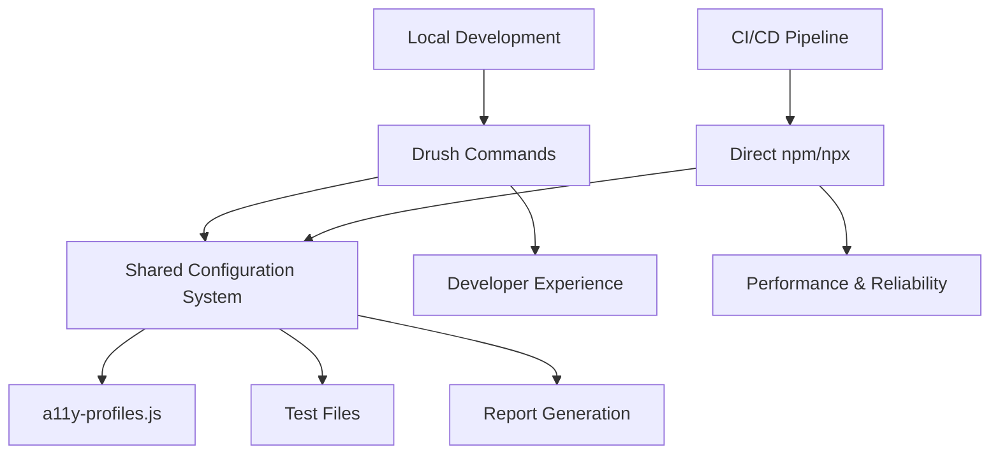

# Accessibility Testing Configuration

This directory contains the centralized configuration system for accessibility testing across both Siteimprove Alfa and axe-core/axe Developer Hub frameworks.

> **Documentation navigation:** For project overview and quick start guide, see the [Main README](../../../README.md). This document provides detailed accessibility testing configuration and usage information.

## Files Overview

- **`a11y-profiles.js`** - Main configuration file with testing profiles
- **`rule-mappings.js`** - Reference information about rule tags and frameworks  
- **`test-config.js`** - Additional test configuration utilities
- **`README.md`** - This documentation file

## Accessibility Testing Suite Structure

```text
my-drupal-site/
├── drush/
│   └── Commands/
│       ├── TestingCommands.php          # Main Drush commands for accessibility testing
│       └── UTestReportCommands.php      # Report generation commands
│
├── tests/
│   ├── package.json                     # Node.js dependencies for all test frameworks
│   ├── playwright.config.ts             # Playwright configuration
│   ├── .pa11yci.json                   # pa11y-ci configuration (runtime generated)
│   │
│   ├── accessibility/                   # Main accessibility testing directory
│   │   ├── config/                     # Centralized configuration system
│   │   │   ├── a11y-profiles.js  # Testing profiles (strict|standard|comprehensive|custom)
│   │   │   ├── rule-mappings.js        # Rule tag reference and framework differences
│   │   │   ├── test-config.js          # Configuration testing utility
│   │   │   └── README.md               # This documentation file
│   │   │
│   │   ├── alfa/                       # Siteimprove Alfa tests
│   │   │   ├── alfa-accessibility.spec.js      # Main Alfa test (specific paths)
│   │   │   ├── alfa-full-site.spec.js          # Full site audit via sitemap
│   │   │   ├── alfa-config.js                  # Alfa-specific configuration
│   │   │   ├── rule-fetcher.js                 # Rule metadata from the @siteimprove/alfa-rules SDK (in-process, no network)
│   │   │   ├── rule-fallbacks.js               # Static fallback data + severity/display helpers (retired rules)
│   │   │   ├── rule-titles.json                # Static map of rule id -> friendly title (e.g. SIA-R53 -> "Headings are structured")
│   │   │   ├── generate-rule-titles.mjs        # One-time tool to regenerate rule-titles.json after an SDK bump (not run during tests)
│   │   │   └── dynamic-rule-extractor.js       # Rule-info accessor (SDK first, then fallback)
│   │   │
│   │   ├── axe/                        # axe-core and axe Developer Hub tests
│   │   │   ├── a11y.spec.ts                    # Standard axe-core test
│   │   │   ├── a11y-watcher.spec.ts            # axe Developer Hub integration
│   │   │   └── axe-watcher-full-site.spec.ts   # Full site audit with Developer Hub
│   │   │
│   │   ├── pa11y/                      # pa11y accessibility testing
│   │   │   └── .pa11yci.base.json              # Base pa11y configuration template
│   │   │
│   │   └── utils/                      # Shared testing utilities
│       └── test-helpers.js             # Common test helper functions
│   │
│   ├── reports/                        # Generated test reports
│   │   └── pa11y.log                   # pa11y-ci output log
│   │
│   ├── playwright-report/              # Playwright HTML reports
│   └── test-results/                   # Playwright test artifacts
│
├── web/sites/default/files/test-reports/  # Web-accessible reports
│   ├── playwright-axe/                 # axe-core reports
│   ├── playwright-axe-watcher/         # axe Developer Hub reports
│   ├── playwright-axe-watcher-full/    # Full site axe reports
│   └── alfa/                           # Alfa reports
│
└── .github/workflows/
    ├── pr-accessibility-testing.yml    # GitHub Actions workflow
    ├── pr-cleanup.yml                  # Basic cleanup workflow
    └── pr-cleanup-enhanced.yml         # Enhanced cleanup workflow
```

### Command to Framework Mapping

| Drush Command | Framework | Test File | Purpose |
|---------------|-----------|-----------|---------|
| `utest:a11y:axe` | axe-core | `axe/a11y.spec.ts` | Standard axe testing on specific paths |
| `utest:a11y:axe-watcher` | axe Developer Hub | `axe/a11y-watcher.spec.ts` | axe with API integration |
| `utest:a11y:axe-watcher-full` | axe Developer Hub | `axe/axe-watcher-full-site.spec.ts` | Full site audit via sitemap |
| `utest:a11y:alfa` | Siteimprove Alfa | `alfa/alfa-accessibility.spec.js` | Alfa testing on specific paths |
| `utest:a11y:alfa-full` | Siteimprove Alfa | `alfa/alfa-full-site.spec.js` | Full site audit via sitemap |
| `utest:a11y:pa11y` | pa11y-ci | N/A (CLI tool) | Sitemap-based testing |
| `utest:all` | All frameworks | Multiple | Run all accessibility tests |

## Current Test Structure

The accessibility testing suite includes the following test files:

### Siteimprove Alfa Tests (`tests/accessibility/alfa/`)

- **`alfa-accessibility.spec.js`** - Main Alfa accessibility test
- **`alfa-full-site.spec.js`** - Full site accessibility test with Alfa
- **`alfa-config.js`** - Alfa-specific configuration
- **`rule-fetcher.js`** - Rule metadata served in-process from the official `@siteimprove/alfa-rules` SDK (no network, no scraping)
- **`rule-fallbacks.js`** - Static fallback data and severity/display helpers for rules the SDK doesn't ship (retired IDs)
- **`rule-titles.json`** - Static map of rule id → friendly title shown in the report alongside the id (e.g. `SIA-R53` → "Headings are structured"). Unmapped rules fall back to the id.
- **`generate-rule-titles.mjs`** - One-time maintenance tool to regenerate `rule-titles.json` (and report rule drift) after bumping `@siteimprove/alfa-rules`; never run during tests
- **`dynamic-rule-extractor.js`** - Resolves rule info (SDK first, then fallback); enriches with severity/category

### axe Developer Hub Tests (`tests/accessibility/axe/`)

- **`a11y.spec.ts`** - Standard axe-core accessibility test
- **`a11y-watcher.spec.ts`** - Basic axe Developer Hub integration test
- **`axe-watcher-full-site.spec.ts`** - Full site test with axe Developer Hub API

### pa11y Tests (`tests/accessibility/pa11y/`)

- **`.pa11yci.base.json`** - Base pa11y configuration template

## Testing Profiles

The system supports four testing profiles that work consistently across both frameworks:

### 1. Comprehensive (Default)

- **Tags**: `wcag2a`, `wcag2aa`, `wcag21a`, `wcag21aa`, `best-practice`
- **Description**: Complete accessibility testing with all WCAG levels + best practices
- **Use Case**: Most thorough testing, recommended for production sites

### 2. Standard

- **Tags**: `wcag2a`, `wcag2aa`, `wcag21a`, `wcag21aa`
- **Description**: WCAG 2.0/2.1 Level A and AA compliance rules
- **Use Case**: Balanced testing for WCAG compliance without best practices

### 3. Strict

- **Tags**: `wcag2a`, `wcag21a`
- **Description**: Only WCAG 2.0/2.1 Level A compliance rules
- **Use Case**: Most restrictive testing, minimum accessibility requirements

### 4. Custom

- **Tags**: User-defined via environment variables
- **Description**: Flexible configuration for specific testing needs
- **Use Case**: Specialized testing scenarios or gradual implementation

## Environment Variables

Control testing behavior using these environment variables:

```bash
# Set testing profile
export A11Y_PROFILE=comprehensive  # comprehensive|standard|strict|custom

# Custom rule tags (for custom profile)
export A11Y_CUSTOM_TAGS=wcag2a,wcag2aa,best-practice

# Override severity levels
export A11Y_SEVERITY_LEVELS=critical,serious,moderate
```

## Usage Examples

### Basic Usage (Default Comprehensive)

```bash
# Uses comprehensive profile by default
drush utest:a11y:alfa --base-url=https://example.com
drush utest:a11y:axe-watcher --base-url=https://example.com
```

### Profile Selection

```bash
# Standard profile (A + AA only)
A11Y_PROFILE=standard drush utest:a11y:alfa --base-url=https://example.com

# Strict profile (A only)
A11Y_PROFILE=strict drush utest:a11y:axe-watcher --base-url=https://example.com

# Custom profile
A11Y_PROFILE=custom A11Y_CUSTOM_TAGS=wcag2a,wcag21aa drush utest:a11y:alfa
```

### Drush Command Options

```bash
# Profile selection via command options
drush utest:a11y:alfa --a11y-profile=standard
drush utest:a11y:axe-watcher --a11y-profile=comprehensive
drush utest:a11y:alfa --a11y-profile=custom --a11y-custom-tags=wcag2a,wcag21aa

# Additional examples with all supported options
drush utest:a11y:axe --base-url=https://example.com --a11y-profile=strict
drush utest:a11y:axe-watcher --axe-api-key=your-key --a11y-severity-levels=critical,serious
drush utest:a11y:alfa-full --sitemap-url=https://example.com/sitemap.xml --max-pages=100
```

## Local Development vs CI/CD Execution

The accessibility testing system uses a **dual approach architecture** that optimizes for different execution environments while maintaining configuration consistency.

### Architectural Overview



### Local Development: Drush Commands

**Recommended for:** Developer workflow, manual testing, local debugging

```bash
# Local development examples
drush utest:a11y:alfa-full --base-url=https://local.example.com --a11y-profile=comprehensive
drush utest:a11y:axe-watcher-full --axe-api-key=your-key --max-pages=25
drush utest:all --base-url=https://local.example.com
```

**Benefits:**

- **Drupal Integration**: Seamless integration with Drupal development workflow
- **Parameter Handling**: Rich command-line options and validation
- **Environment Setup**: Automatic environment variable configuration
- **Report Management**: Built-in report organization and indexing
- **Developer Experience**: Familiar Drush interface for Drupal developers
- **Batch Operations**: Easy execution of multiple test types with `utest:all`

### CI/CD: Direct npm/npx Execution

**Recommended for:** GitHub Actions, automated testing, production pipelines

```bash
# CI/CD examples (from GitHub Actions)
cd tests
export BASE_URL="${MULTIDEV_URL}"
export A11Y_PROFILE=comprehensive
npx playwright test accessibility/alfa/alfa-full-site.spec.js --reporter=html
npx playwright test accessibility/axe/axe-watcher-full-site.spec.ts --config=playwright.config.ts
```

**Benefits:**

- **Performance**: Faster execution without Drush overhead
- **Simplicity**: Direct control over test execution and parameters
- **Debugging**: Clearer error messages and stack traces in CI logs
- **Resource Efficiency**: Lower memory footprint and faster startup
- **Flexibility**: Direct access to all Playwright CLI options
- **Industry Standard**: Matches CI/CD best practices for Node.js projects

### Execution Method Comparison

| Aspect | Local Development (Drush) | CI/CD (npm/npx) |
|--------|---------------------------|------------------|
| **Performance** | Moderate (Drush overhead) | Fast (direct execution) |
| **Setup Complexity** | Simple (built-in commands) | Moderate (env vars + commands) |
| **Parameter Handling** | Rich CLI options | Environment variables |
| **Error Debugging** | Drush-filtered messages | Raw Playwright output |
| **Resource Usage** | Higher (PHP + Node.js) | Lower (Node.js only) |
| **Drupal Integration** | Native | Manual configuration |
| **Report Management** | Automatic indexing | Manual organization |
| **Flexibility** | Predefined options | Full Playwright control |

### Best Practices by Environment

#### **Local Development**

```bash
# Use Drush commands for development workflow
drush utest:a11y:alfa-full --a11y-profile=comprehensive --max-pages=10
drush utest:a11y:axe-watcher --paths="/,/about,/contact" --a11y-profile=standard

# Quick profile testing
A11Y_PROFILE=strict drush utest:a11y:alfa --base-url=https://local.example.com

# Comprehensive testing with report indexing
drush utest:all --base-url=https://local.example.com --index=TRUE
```

#### **CI/CD Pipelines**

```yaml
# GitHub Actions example
- name: Run accessibility tests
  run: |
    cd tests
    export BASE_URL="${{ steps.setvars.outputs.multidev_url }}"
    export A11Y_PROFILE=comprehensive
    export A11Y_SEVERITY_LEVELS=critical,serious
    
    # Run tests directly for optimal performance
    npx playwright test accessibility/alfa/alfa-full-site.spec.js --reporter=html
    npx playwright test accessibility/axe/axe-watcher-full-site.spec.ts --config=playwright.config.ts
```

#### **Hybrid Approach**

```bash
# Validate configuration consistency across both approaches
cd tests/accessibility/config
node test-config.js

# Local development
drush utest:a11y:alfa-full --a11y-profile=comprehensive

# Verify same configuration works in CI format
cd tests
export A11Y_PROFILE=comprehensive
npx playwright test accessibility/alfa/alfa-full-site.spec.js --dry-run
```

### Configuration Consistency

Both execution methods share the **same underlying system**:

#### **Shared Components:**

- **Configuration System**: `tests/accessibility/config/a11y-profiles.js`
- **Test Files**: Same Playwright test specifications
- **Environment Variables**: `A11Y_PROFILE`, `A11Y_SEVERITY_LEVELS`, etc.
- **Report Format**: Identical HTML and JSON outputs
- **Rule Sets**: Same WCAG tag mappings and severity levels

#### **Environment Variable Mapping:**

```bash
# Drush command
drush utest:a11y:alfa-full --a11y-profile=comprehensive --max-pages=50

# Equivalent npm/npx execution
export A11Y_PROFILE=comprehensive
export ALFA_MAX_PAGES=50
npx playwright test accessibility/alfa/alfa-full-site.spec.js
```

### Troubleshooting Execution Issues

#### **Local Development Issues**

```bash
# Verify Drush commands are available
drush list | grep utest

# Check Node.js dependencies
drush utest:js-install

# Validate configuration
cd tests/accessibility/config && node test-config.js
```

#### **CI/CD Issues**

```bash
# Verify environment variables
echo "Profile: $A11Y_PROFILE"
echo "Base URL: $BASE_URL"

# Check test file existence
ls -la tests/accessibility/alfa/alfa-full-site.spec.js
ls -la tests/accessibility/axe/axe-watcher-full-site.spec.ts

# Validate Playwright installation
npx playwright --version
```

### Migration Between Approaches

#### **From Drush to npm/npx:**

```bash
# Drush command
drush utest:a11y:alfa-full --base-url=https://example.com --a11y-profile=standard

# Equivalent npm/npx
cd tests
export BASE_URL=https://example.com
export A11Y_PROFILE=standard
npx playwright test accessibility/alfa/alfa-full-site.spec.js
```

#### **From npm/npx to Drush:**

```bash
# npm/npx execution
export A11Y_PROFILE=comprehensive
export AXE_API_KEY=your-key
npx playwright test accessibility/axe/axe-watcher-full-site.spec.ts

# Equivalent Drush command
drush utest:a11y:axe-watcher-full --a11y-profile=comprehensive --axe-api-key=your-key
```

## Complete Drush Command Reference

### Core Accessibility Commands

#### `utest:a11y:axe` (alias: `utaxe`)

Standard axe-core testing on specific paths.

```bash
drush utest:a11y:axe [OPTIONS]
  --base-url=URL                    # Base URL for testing (default: http://127.0.0.1:8888)
  --paths=PATHS                     # Comma-separated paths (default: sitemap.xml when reachable, else /,/user/login)
  --a11y-profile=PROFILE            # Testing profile: comprehensive|standard|strict|custom (default: comprehensive)
  --a11y-custom-tags=TAGS           # Custom rule tags for custom profile (comma-separated)
  --a11y-severity-levels=LEVELS     # Severity levels to include (comma-separated)
```

#### `utest:a11y:axe-watcher` (alias: `utaxew`)

axe Developer Hub integration with API key.

```bash
drush utest:a11y:axe-watcher [OPTIONS]
  --base-url=URL                    # Base URL for testing
  --paths=PATHS                     # Comma-separated paths to test
  --axe-api-key=KEY                 # axe Developer Hub API key (or use AXE_API_KEY env var)
  --a11y-profile=PROFILE            # Testing profile
  --a11y-custom-tags=TAGS           # Custom rule tags
  --a11y-severity-levels=LEVELS     # Severity levels
```

#### `utest:a11y:axe-watcher-full` (alias: `utaxewf`)

Full site audit with axe Developer Hub via sitemap.

```bash
drush utest:a11y:axe-watcher-full [OPTIONS]
  --base-url=URL                    # Base URL for testing
  --sitemap-url=URL                 # Sitemap URL (default: {base-url}/sitemap.xml)
  --max-pages=NUMBER                # Maximum pages to test (default: 50)
  --axe-api-key=KEY                 # axe Developer Hub API key
  --a11y-profile=PROFILE            # Testing profile
  --a11y-custom-tags=TAGS           # Custom rule tags
  --a11y-severity-levels=LEVELS     # Severity levels (full-site uses all by default)
```

#### `utest:a11y:alfa` (alias: `utalfa`)

Siteimprove Alfa testing on specific paths.

```bash
drush utest:a11y:alfa [OPTIONS]
  --base-url=URL                    # Base URL for testing
  --paths=PATHS                     # Comma-separated paths to test
  --a11y-profile=PROFILE            # Testing profile
  --a11y-custom-tags=TAGS           # Custom rule tags
  --a11y-severity-levels=LEVELS     # Severity levels
```

#### `utest:a11y:alfa-full` (alias: `utalfaf`)

Full site audit with Siteimprove Alfa via sitemap.

```bash
drush utest:a11y:alfa-full [OPTIONS]
  --base-url=URL                    # Base URL for testing
  --sitemap-url=URL                 # Sitemap URL (default: {base-url}/sitemap.xml)
  --max-pages=NUMBER                # Maximum pages to test (default: 50)
  --a11y-profile=PROFILE            # Testing profile
  --a11y-custom-tags=TAGS           # Custom rule tags
  --a11y-severity-levels=LEVELS     # Severity levels
```

#### `utest:a11y:pa11y` (alias: `utpa11y`)

pa11y-ci testing via sitemap.

```bash
drush utest:a11y:pa11y [OPTIONS]
  --base-url=URL                    # Base URL for testing (sitemap will be {base-url}/sitemap.xml)
```

### Utility Commands

#### `utest:js-install` (alias: `utjsi`)

Install Node.js dependencies for testing.

```bash
drush utest:js-install
```

#### `utest:browsers` (alias: `utbr`)

Install Playwright browsers.

```bash
drush utest:browsers
```

#### `utest:all` (alias: `utall`)

Run all accessibility tests.

```bash
drush utest:all [OPTIONS]
  --base-url=URL                    # Base URL for testing
  --paths=PATHS                     # Comma-separated paths for individual tests
  --sitemap-url=URL                 # Sitemap URL for full-site tests
  --run-id=ID                       # Run identifier for reports (default: local)
  --index=BOOL                      # Build report index (default: TRUE)
  --title=TITLE                     # Report index title (default: Upstream Test Reports)
```

## Framework Differences

While both frameworks use the same WCAG tags, they have different implementations:

### axe-core 4.10

- **Rule Format**: kebab-case (e.g., `color-contrast`, `heading-order`)
- **Rule Count**: 90+ rules
- **Strengths**: Fast execution, low false positives, excellent CI/CD integration
- **Best Practice Support**: Direct `best-practice` tag support

### Siteimprove Alfa

- **Rule Format**: SIA-R format (e.g., `SIA-R61`, `SIA-R72`, `SIA-R111`)
- **Rule Count**: 100+ rules
- **Strengths**: Comprehensive coverage, detailed reporting, advanced ARIA support
- **Best Practice Support**: Included in comprehensive rule coverage (no separate tag)

## Configuration in Test Files

### Alfa Tests

```javascript
const { getAccessibilityConfig } = require('../config/a11y-profiles.js');

// Get Alfa-specific configuration
const config = getAccessibilityConfig('alfa');

const results = await Audit.run(alfaPage, {
  rules: {
    tags: config.tags
  }
});
```

### axe-core Tests

```javascript
const { getAccessibilityConfig } = require('../config/a11y-profiles.js');

// Get axe-specific configuration
const config = getAccessibilityConfig('axe');

const results = await new AxeBuilder({ page })
  .withTags(config.tags)
  .analyze();
```

## Profile Information

Get profile information programmatically:

```javascript
const { getProfileInfo, listProfiles } = require('./config/a11y-profiles.js');

// Get current profile info
const info = getProfileInfo();
console.log(`Using ${info.name}: ${info.description}`);

// List all available profiles
const profiles = listProfiles();
profiles.forEach(profile => {
  console.log(`${profile.key}: ${profile.name}`);
});
```

## Configuration Testing Utility

The `test-config.js` file is a comprehensive testing utility that validates the accessibility configuration system. This tool helps ensure that profile changes work correctly and provides detailed information about how configurations are applied across different frameworks.

### Purpose and Benefits

- **Validates configuration changes** - Test that profile modifications work as expected
- **Debugging tool** - Troubleshoot configuration issues by showing exact tag and option mappings
- **Documentation by example** - Demonstrates how the configuration system works in practice
- **Quality assurance** - Prevents configuration drift and catches breaking changes
- **Learning tool** - Helps new developers understand the accessibility configuration system

### How to Run the Configuration Test

```bash
# Navigate to the config directory
cd tests/accessibility/config

# Run the configuration test utility
node test-config.js
```

### Sample Output and Interpretation

When you run the test, you'll see comprehensive output organized into sections:

#### 1. Available Profiles

```text
Available Profiles:
   strict: Strict Mode (WCAG Level A only)
      Only WCAG 2.0/2.1 Level A compliance rules with all severity levels - most restrictive rule set

   standard: Standard Mode (WCAG Level A + AA)
      WCAG 2.0/2.1 Level A and AA compliance rules with all severity levels - balanced testing
```

#### 2. Profile Testing by Framework

```text
Testing Profile: COMPREHENSIVE
   Profile Info: Comprehensive Mode (All WCAG Levels + Best Practices)
   Description: Complete accessibility testing: All WCAG levels + best practices with all severity levels - most thorough testing
   AXE Config:
      Tags: wcag2a, wcag2aa, wcag21a, wcag21aa, best-practice
      Severity: critical, serious, moderate, minor
      Options: runOnly
   ALFA Config:
      Tags: wcag2a, wcag2aa, wcag21a, wcag21aa
      Severity: critical, serious, moderate, minor
      Options: includeInconclusiveResults, waitForNetworkIdle, timeout
```

#### 3. Rule Tag Information

```text
Rule Tag Information:
   wcag2a: WCAG 2.0 Level A compliance rules (Level A, WCAG 2.0)
   wcag2aa: WCAG 2.0 Level AA compliance rules (Level AA, WCAG 2.0)
   wcag21a: WCAG 2.1 Level A compliance rules (Level A, WCAG 2.1)
```

#### 4. Severity Level Details

```text
Severity Levels:
   critical: Critical accessibility violations that prevent access (Priority 1)
   serious: Serious accessibility violations that significantly impact users (Priority 2)
   moderate: Moderate accessibility issues that affect user experience (Priority 3)
   minor: Minor accessibility issues that may affect some users (Priority 4)
```

#### 5. Framework Information

```text
Framework Information:
   axe-core 4.10 (Deque Systems):
      Rule Count: 90+
      Rule Format: kebab-case (e.g., color-contrast, heading-order)
      Strengths: Fast automated testing, Low false positive rate...
```

#### 6. Environment Variable Testing

```text
Testing Environment Variable Overrides:
   Override Test - Profile: Standard Mode (WCAG Level A + AA)
   Override Test - Severity: critical, serious, moderate
```

### When to Use the Configuration Test

#### During Development

```bash
# After modifying a11y-profiles.js or rule-mappings.js
node test-config.js

# Verify your changes work correctly before committing
```

#### Debugging Configuration Issues

```bash
# When tests aren't using expected rules
A11Y_PROFILE=custom A11Y_CUSTOM_TAGS=wcag2a,wcag21aa node test-config.js

# Check if environment variables are being applied correctly
```

#### Learning the System

```bash
# Understand how different profiles work
node test-config.js | grep -A 10 "COMPREHENSIVE"

# See all available rule tags and their descriptions
node test-config.js | grep -A 20 "Rule Tag Information"
```

### Integration with Development Workflow

#### Before Making Configuration Changes

1. Run the test to establish baseline: `node test-config.js > before.txt`
2. Make your configuration changes
3. Run the test again: `node test-config.js > after.txt`
4. Compare outputs: `diff before.txt after.txt`

#### Validating New Profiles

```bash
# Test a new profile you've added
A11Y_PROFILE=your-new-profile node test-config.js
```

#### CI/CD Integration (Optional)

You can add this to your CI pipeline to ensure configuration integrity:

```bash
# In your CI script
cd tests/accessibility/config
node test-config.js > /dev/null
if [ $? -eq 0 ]; then
  echo "Configuration test passed"
else
  echo "Configuration test failed"
  exit 1
fi
```

### Interpreting Test Results

#### Successful test indicators

- All profiles load without errors
- Each framework gets appropriate tag configurations
- Environment variable overrides work correctly
- Rule tag information is available for all tested tags
- Framework information loads properly

#### Potential issues to look for

- **Missing profile errors** - Profile not found in `a11y-profiles.js`
- **Empty tag arrays** - Profile not returning expected tags
- **Framework differences** - Unexpected differences between axe and Alfa configurations
- **Environment variable failures** - Overrides not being applied

#### Common fixes

- **Profile not found**: Check spelling in `a11y-profiles.js` and ensure it's exported
- **Wrong tags**: Verify tag names match those in `rule-mappings.js`
- **Environment issues**: Ensure environment variables are set correctly
- **Framework problems**: Check framework-specific configurations in profiles

### Best Practices

1. **Run after any configuration changes** to ensure nothing breaks
2. **Use environment variable testing** to validate override behavior
3. **Check both axe and Alfa configurations** to ensure consistency
4. **Review rule tag mappings** when adding new WCAG criteria
5. **Document any new profiles** you add to the system

This testing utility is essential for maintaining the reliability and consistency of the accessibility configuration system across all testing frameworks.

## Rule Tag Reference

### WCAG 2.0 Tags

- `wcag2a` - Level A compliance
- `wcag2aa` - Level AA compliance  
- `wcag2aaa` - Level AAA compliance

### WCAG 2.1 Tags

- `wcag21a` - Level A compliance (includes 2.0 A + new 2.1 A criteria)
- `wcag21aa` - Level AA compliance (includes 2.0 AA + new 2.1 AA criteria)
- `wcag21aaa` - Level AAA compliance

### Best Practices

- `best-practice` - Accessibility best practices beyond WCAG (axe-core only)

### Category Tags (axe-core only)

- `cat.color` - Color and contrast rules
- `cat.keyboard` - Keyboard accessibility
- `cat.forms` - Form accessibility
- `cat.images` - Image accessibility
- `cat.headings` - Heading structure
- `cat.tables` - Table accessibility

## Severity Levels

Both frameworks support these severity levels:

- **Critical**: Prevents access entirely
- **Serious**: Significantly impacts users
- **Moderate**: Affects user experience
- **Minor**: May affect some users

## Extending the Configuration

To add new profiles or modify existing ones:

1. Edit `a11y-profiles.js` to add new profile definitions
2. Update this README with documentation
3. Test with both Alfa and axe-core frameworks
4. Update Drush commands if needed

## Troubleshooting

### Profile Not Found

If you see "Unknown accessibility profile" warnings:

- Check the `A11Y_PROFILE` environment variable spelling
- Verify the profile exists in `a11y-profiles.js`
- Default will fall back to 'comprehensive' mode

### Different Results Between Frameworks

This is expected behavior:

- Each framework has different rule implementations
- Coverage varies between engines
- Use both frameworks for comprehensive testing
- Focus on issues found by both engines for highest confidence

### Custom Tags Not Working

For custom profile issues:

- Ensure `A11Y_PROFILE=custom` is set
- Verify `A11Y_CUSTOM_TAGS` contains valid tag names
- Check that tags are supported by the framework being used
- Refer to rule-mappings.js for available tags
